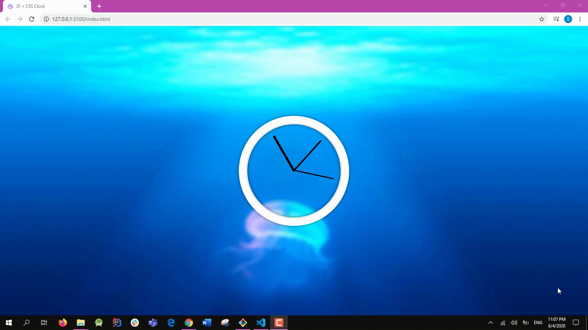

# Clock JS 🕥
Turing the clock hands according to the current time with *JS*.

The thickest hand is for **hours** ⌛️, the thinnest is for **seconds**, and the third one - yeah you got it 😄 - is for **minuts**.

Below you can see the output:

