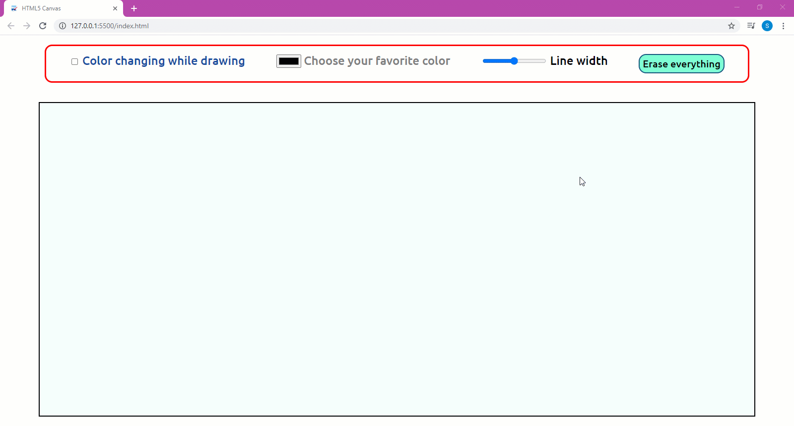

# Draw on Canvas

__HTML5 canvas__ are powerful addition to the markup language, they allow us to design simple games, among these beautiful ideas is a draw sheete.

I realised simple drawing sheet with canvas that allow you : draw with your favorite color and your specified width, or you can choose changing color (it's awsome just try it). After that you can erase everything.

